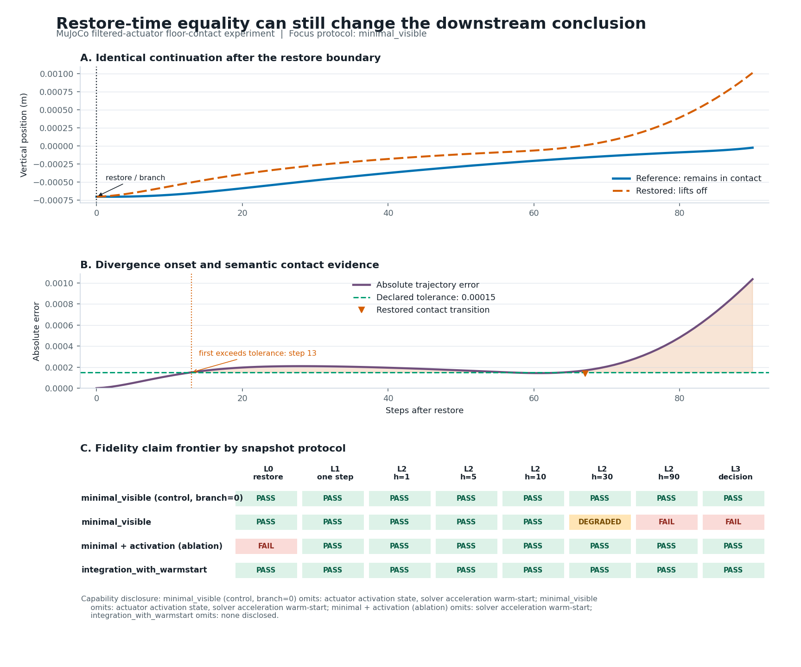

# IPFD: Can You Trust This Simulator Snapshot?

[](https://github.com/yusufdxb/ipfd/actions/workflows/ci.yml)
[](LICENSE)
[](pyproject.toml)

Simulator snapshots are routinely treated as counterfactual ground truth:
restore a state, branch with another controller, and compare the outcome. A
matching state at restoration does not guarantee an equivalent future.

IPFD audits that assumption before a restored branch is used to support a
research or engineering conclusion. It reports where divergence begins, which
semantic events change, how fidelity depends on horizon, whether a richer
snapshot helps, and whether the named downstream decision still agrees.



## See the failure in one command

```bash
git clone https://github.com/yusufdxb/ipfd
cd ipfd
python3 -m venv .venv
. .venv/bin/activate
python -m pip install -e ".[dev,mujoco]"
ipfd demo
```

The asset-free MuJoCo demo finishes in a few seconds and writes
`ipfd-demo-results/{summary.json,evidence.json,report.png,artifact_manifest.json}`.

```text
RESTORE BOUNDARY
minimal_visible              PASS (measured exposed fields)
integration_with_warmstart   PASS
Unavailable under minimal_visible: actuator activation, solver warm-start

FINITE-HORIZON REPLAY
                             h=1    h=5   h=10   h=30   h=90
minimal_visible                PASS   PASS   PASS DEGRADED   FAIL
minimal + activation           PASS   PASS   PASS   PASS   PASS
integration_with_warmstart     PASS   PASS   PASS   PASS   PASS

DOWNSTREAM DECISION AT h=90
minimal_visible:
  reference = remains in contact
  restored  = lifts off
  verdict   = FAIL_CLOSED
```

This is a real simulator experiment, not a hardcoded result. A filtered actuator
presses a sphere into a floor for 100 control steps. IPFD snapshots the branch,
restores it into a second `MjData`, and sends both instances the same future
controls.

The narrow protocol captures time, qpos, qvel, control history, and control. At
the boundary, measured qpos, qvel, policy observation, contact state, and control
agree. It explicitly does not capture actuator activation or solver warm-start.
The position error first exceeds the declared `1.5e-4 m` tolerance at step 13,
the contact modes disagree at step 67, and the h=90 decision reverses. MuJoCo's
integration-state protocol is bit-exact through h=90 in the same run and
preserves the decision.

A mechanism ablation captures actuator activation while still omitting solver
warm-start state. It removes the trajectory and decision mismatch through h=90.
Its exact L0 check still fails on a derived warm-start-dependent field, so the
ablation is diagnostic evidence, not the recommended full protocol. The
integration-state protocol passes L0 through L3.

The initialization control case also passes with the narrow protocol because the
omitted actuator activation is zero there. This isolates the failure to the
snapshot contract at a preloaded state, not generic nondeterminism or broken
pairing. Three deterministic seeded initial offsets exercise the same semantic
result; they are a regression fixture, not a population estimate. A sensitivity
check reports agreement at continuation controls `0.50` and `0.60`, with the
declared boundary case at `0.55` disagreeing. This exposes the decision boundary
without implying broad robustness.

The engineering decision changes immediately: do not use this narrow snapshot
to claim that a release controller preserves contact over 90 steps. Capture
actuator activation or the full integration state, shorten the supported
horizon, or collect uninterrupted evidence.

## Fidelity claims are hierarchical

| Level | Question | Demo result for preloaded `minimal_visible` |
|---|---|---|
| L0, restore boundary | Do required measured fields agree immediately after restore? | Pass, with omitted causal fields disclosed |
| L1, local dynamics | Does one identical action stay within declared numeric and semantic tolerances? | Pass |
| L2, finite-horizon replay | Does the branch stay fit at each requested horizon? | Pass at 1, 5, 10; degraded at 30; fail at 90 |
| L3, decision fidelity | Does the named downstream conclusion agree? | Fail at h=90 |

L0 never implies L1, L2, or L3. `SUPPORTED` is scoped empirical support for the
named simulator version, task, protocol, branch condition, action continuation,
decision, tolerances, and tested horizons. It is not certification of a
simulator. `INSUFFICIENT_EVIDENCE` is not a pass.

IPFD does not define an L4 intervention claim yet. The current live runner does
not implement the nested paired design needed to compare intervention rankings
rigorously.

## Audit and compare snapshot protocols

The demo protocols are ordinary audit configurations:

```bash
ipfd audit --config benchmarks/demo_filtered_minimal.yaml
ipfd audit --config benchmarks/demo_filtered_integration.yaml

ipfd compare \
  results/demo/filtered_minimal/audit_summary.json \
  results/demo/filtered_integration/audit_summary.json
```

`compare` prints a compact horizon and decision table. Add `--json` for the full
machine-readable protocol delta.

The narrow audit returns exit code `1` after writing its artifacts because its
scoped contract is unsupported. Supported audits return `0`; configuration or
runtime errors return `2`. The demo itself returns `0` when it successfully
detects this expected failure.

Each audit retains per-branch L0-L3 records, divergence curves, protocol
capabilities, decision outcomes, source identities, runtime provenance, and a
fail-closed scoped verdict. Per-field tolerances let position and velocity keep
their own units. Requested actions are checked against the actions recorded by
`step`, and independently rerun horizons must reproduce the same paired
trajectory prefixes before IPFD will report one fidelity frontier.

The broader benchmark matrix also contains free-space, intermittent-contact,
sustained-contact, and archived Isaac Lab evidence. See
[the benchmark protocol](BENCHMARK_PROTOCOL.md) before interpreting those rows.

## Use IPFD as a library

```python
from ipfd import DecisionContract, audit

decision = DecisionContract(
    name="object_remains_stable",
    evaluator=lambda trajectory: bool(
        trajectory.steps[-1].task_outputs["stable"][trajectory.env_id]
    ),
    description="stability at the requested replay horizon",
    true_label="stable",
    false_label="unstable",
)

result = audit(
    adapter=my_adapter,
    protocol="expanded_runtime_state",
    branch_step=120,
    horizons=[1, 5, 10, 30, 90],
    continuation="exact_action",
    decision=decision,
    tolerances={
        "default": {"absolute": 0.0, "relative": 0.0},
        "scene_state": {
            "absolute": 0.0,
            "fields": {
                "qpos": {"absolute": 1e-5},
                "qvel": {"absolute": 1e-4},
            },
        },
    },
)

print(result.verdict)
print(result.fidelity_frontier)
```

`DecisionContract` records the predicate name, parameters, semantic labels, and
available source identity. IPFD evaluates it twice on each immutable trajectory
and rejects a nondeterministic predicate. L3 records include reference and
restored labels plus a neutral disagreement direction such as
`REFERENCE_TRUE_RESTORED_FALSE`.

See the [quickstart](docs/QUICKSTART.md) and
[custom adapter guide](docs/CUSTOM_ADAPTER.md).

## Validate a simulator adapter

```bash
ipfd adapter-check my_lab.ipfd_adapter:make_adapter \
  --decision task_success \
  --output adapter-check.json
```

The conformance suite checks the integration mistakes that make replay evidence
untrustworthy:

- capture-by-value rather than live simulator views;
- deterministic repeated capture;
- explicit unavailable-state inventory;
- incompatible snapshot rejection;
- identical paired action generation and delivery;
- restore-boundary comparison;
- observation side effects;
- evidence against accidental automatic reset;
- provenance completeness;
- semantic-decision determinism.

A conformance pass is scoped to the sampled seed and step. It does not prove that
every simulator state is serialized.

A complete adapter that can be run and copied is included:

```bash
python examples/custom_adapter.py
ipfd adapter-check examples.custom_adapter:make_adapter \
  --decision threshold_reached
ipfd audit --config examples/custom_adapter.yaml
```

## Why this is more than `save`, `restore`, `allclose`

An immediate equality check cannot tell you:

- whether the next dynamics step agrees;
- when a small error becomes decision-relevant;
- whether contact, termination, success, or collision events change;
- which tested horizons remain usable;
- whether a richer protocol moves the fidelity frontier;
- whether an error makes a branch falsely optimistic or falsely pessimistic;
- whether the adapter captured values by copy and disclosed missing state;
- which runtime, assets, code, tolerances, and actions produced the evidence.

IPFD retains those distinctions in machine-readable records instead of reducing
snapshot fidelity to one scalar.

## Origin: the negative result became the product

IPFD began as a Point-of-No-Return debugger for Isaac Lab manipulation. It saved
a state, restored a recovery branch, and treated the branch outcome as evidence
about the uninterrupted episode. That interpretation required restored branches
to preserve the downstream recovery decision.

They did not. In the corrected five-seed Isaac Lab study, the richer archived
protocol still produced 11 decision disagreements in 444 primary exact-action
comparisons. At h=90, 10 of 74 tested branch points disagreed for the primary
predicate. The richer protocol reduced the observed error relative to the narrow
protocol but did not meet the preregistered improvement threshold. With only five
independent seed groups, this is bounded failure evidence, not a simulator-wide
rate estimate.

That invalidated the original Point-of-No-Return interpretation and motivated the
current tool:

> We tried to use restored branches as ground truth. The assumption failed. IPFD
> now measures the assumption directly.

The record is preserved rather than rewritten:

- [Archived negative result](ARCHIVED_NEGATIVE_RESULT.md)
- [Corrected experiment protocol](CORRECTED_EXPERIMENT_PROTOCOL.md)
- [Snapshot protocol inventory](SNAPSHOT_PROTOCOLS.md)
- [Final evidence ledger](FINAL_EVIDENCE_LEDGER.md)
- [Counterfactual fidelity analysis](docs/COUNTERFACTUAL_FIDELITY.md)
- [Historical baseline](HISTORICAL_BASELINE.md)

The old rollout analyzer remains available for artifact compatibility:

```bash
ipfd analyze rollout.npz --report report.json --plot timeline.png
```

## Limits

- The bundled demo proves an incomplete MuJoCo state contract can reverse one
  contact decision. It is not evidence that correct MuJoCo snapshots are
  generally unreliable.
- The demo's richer protocol passing through h=90 does not support longer
  horizons, other models, other task phases, closed-loop policies, or other
  MuJoCo builds without a new audit.
- The archived Isaac Lab result is one task, policy checkpoint, runtime, and
  sampled branch distribution. It does not identify a universal PhysX failure.
- Hardware-dependent Isaac claims require a compatible live runtime. CPU replay
  of archived records cannot create new simulator evidence.
- Tolerances and decision predicates are part of the scientific claim. IPFD
  records and checks them; it cannot choose task-valid thresholds for the user.

## Development

```bash
pytest
ruff check .
mypy src/ipfd
python -m build --wheel
```

The analysis layer does not import Isaac Lab. MuJoCo is optional under the
`mujoco` extra. See [validation](docs/VALIDATION.md),
[reproduction](docs/REPRODUCE.md), [contributing](CONTRIBUTING.md), and
[security](SECURITY.md).

## Citation and license

Citation metadata is in [`CITATION.cff`](CITATION.cff). IPFD is MIT licensed;
see [`LICENSE`](LICENSE) and [`THIRD_PARTY_LICENSES.md`](THIRD_PARTY_LICENSES.md).
