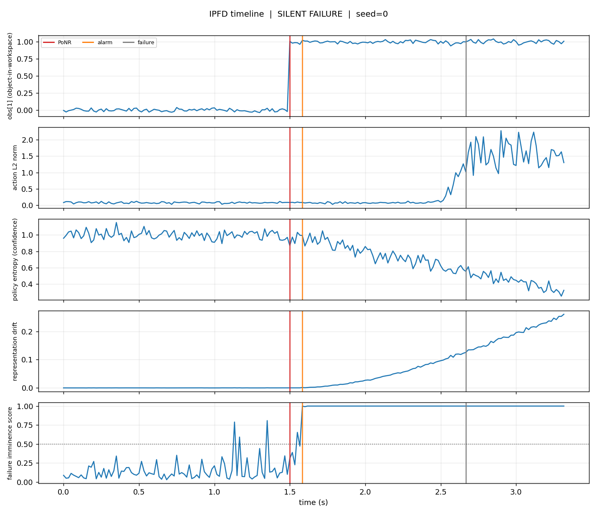

# IPFD — Isaac Policy Failure Debugger

**Find the exact moment a policy is doomed — before it visibly fails.**

IPFD is a small, headless debugging utility for robot-policy rollouts in
[Isaac Lab](https://isaac-sim.github.io/IsaacLab/). It answers one question an
average-success-rate number can never answer:

> The policy failed at second 2.7. But *when did it actually become unrecoverable*,
> and *did any internal signal know* before the failure was externally visible?

Scope is deliberately narrow: **Franka Emika Panda, single-object pick-and-place,
Isaac Lab default environment.** No multi-robot zoo, no benchmark suite, no Kit
extension. One sharp tool that does one thing well.

---

## The failure mode it exposes

A well-trained policy can stay **high-confidence after entering an irreversible
failure trajectory**. Success-rate evaluation counts those episodes as "fine" right
up until the object hits the floor. IPFD makes the silent interval visible:



Reading the panels top to bottom (this is the real output of
`examples/run_synthetic.py`, seed 0):

- The object leaves the reachable workspace at the **Point of No Return** (red, 1.5s).
- **Action output stays perfectly calm for ~1 second afterward** — the policy has no
  idea it is doomed. It only thrashes near the externally-observable failure (grey, 2.7s).
- **Policy entropy collapses** (confidence *rises*) through the doomed window — the
  "confident but wrong" signature.
- **Representation drift** and the combined **imminence score** fire at the alarm
  (orange), ~1 second before the action-level thrash a human would notice.

```
=== IPFD Failure Debug Report ===
outcome            : FAILURE
point of no return : step 90 (1.50s)
observable failure : step 160 (2.67s)
detector alarm     : step 95 (1.58s)
failure lead time  : +1.08s   (alarm before visible failure)
PoNR lead time     : -0.08s   (alarm vs irrecoverable; +ve = actionable)
silent-doom window : +1.17s   (doomed but looked fine)
false continuity   : 6%       (of doomed window, detector stayed quiet)
verdict            : SILENT COLLAPSE -- alarm fired only AFTER the trajectory was doomed.
```

The honest reading: **internal signals bought ~1.08s of warning over external
visibility, but landed right at the point of no return** — enough for diagnosis, not
always for prevention. IPFD reports both, and never pretends the alarm was earlier
than it was.

---

## The one hard idea: Point of No Return

"The first timestep the task is irrecoverable, even under optimal control" **cannot
be read off a passive log** — you only know a state was doomed by *trying to recover
from it and failing*. So IPFD defines PoNR operationally against a **recovery probe**:

```
recovery_success[t] == True  <=>  a best-effort recovery controller, restarted from
                                  the saved sim state at step t, reaches the goal
                                  within a fixed budget.
```

`PoNR = the first step after which recovery never again succeeds.` This is a **sound
upper bound** on the true optimal-control PoNR (a better recovery controller can only
push it later). We say *"irrecoverable under the provided recovery oracle,"* not
*"provably irrecoverable."* Producing `recovery_success` needs a simulator that can
save/restore state; consuming it does not. That boundary is the whole architecture.

---

## Architecture

```
ipfd/
  types.py              Rollout — the single unit of analysis (pure NumPy arrays)
  detectors.py          action-variance / entropy-collapse / drift -> imminence score
  ponr.py               Point of No Return from a recovery-probe array
  metrics.py            time-to-failure, lead time, false continuity, drift@collapse
  report.py             build_report() -> FailureDebugReport (+ .summary(), .to_json())
  viz.py                plot_timeline() — the stacked-panel figure above (Agg, headless)
  adapters/
    synthetic.py        simulator-free rollouts for tests/examples/CI
    isaac_lab.py        real Franka rollout collection + recovery probe (GPU, gated)
```

**The analysis layer never imports a simulator.** Detectors, PoNR, metrics, report,
and viz are pure NumPy/Matplotlib and run in CI without a GPU. Only
`adapters/isaac_lab.py` talks to Isaac Lab, and it is imported lazily.

### Detectors (deliberately simple, no ML, no training)

Each returns a per-step score in `[0,1]`, self-calibrated against the rollout's own
calm early window (robust median + `max(MAD, std)` scale, so calm jitter doesn't
false-alarm). Combined by a weighted max into a single **failure-imminence score**;
`first_alarm` requires the score to persist above threshold to page.

| Detector | Fires on |
|---|---|
| action-variance spike | policy starts thrashing |
| entropy collapse | policy becomes overconfident as it commits |
| representation drift | latent embedding leaves its early-episode manifold |

---

## Quickstart

```bash
pip install -e ".[dev]"      # analysis layer only — no GPU, no Isaac Lab
pytest                        # 24 tests, all pure-NumPy
python examples/run_synthetic.py   # prints two reports, writes plots + JSON to examples/figures/
```

```python
from ipfd import build_report, plot_timeline
from ipfd.adapters.synthetic import make_silent_failure_rollout

rollout = make_silent_failure_rollout(seed=0)
report  = build_report(rollout)
print(report.summary())
plot_timeline(rollout, report, "timeline.png")
```

### With a real Franka rollout (needs Isaac Lab + a GPU)

```python
from ipfd.adapters.isaac_lab import collect_rollout
from ipfd import build_report

rollout = collect_rollout(env, my_policy, recovery_controller=my_recovery, seed=0)
print(build_report(rollout).summary())
```

> `adapters/isaac_lab.py` is **runtime-verified on Isaac Lab 4.5.22** with
> `Isaac-Lift-Cube-Franka-v0` on a live GPU — see
> [`scripts/verify_isaac_runtime.py`](scripts/verify_isaac_runtime.py), which reports
> `overall_verdict: REAL_COMPATIBLE`. Both flagged touchpoints are confirmed against
> the real sim: the observation key is `policy` (shape `(1, 36)`), and
> `env.unwrapped.scene` exposes `get_state()` / `reset_to()`, so the recovery probe
> runs real state save/restore. What is *not* yet shown: **meaningful** pre-failure
> PoNR/imminence needs a trained policy plus a real recovery controller — with an
> untrained oracle the probe never recovers and PoNR degenerates to step 0. That is a
> policy/oracle gap, not an API gap.

### Verifying it yourself

```bash
OMNI_KIT_ACCEPT_EULA=YES \
  ~/Sim/isaac-sim-venv/bin/python scripts/verify_isaac_runtime.py --headless
```

The script launches a live Franka env, drives it through IPFD's own adapter (no
mocks), runs `build_report` on the real rollout, and prints a machine-readable
`IPFD_RUNTIME_COMPATIBILITY` block. It detects every API assumption at runtime rather
than trusting it.

---

## Metrics (the minimal set)

| Metric | Question it answers |
|---|---|
| `time_to_failure` | When did failure become externally observable? |
| `failure_lead_time` | How early did the alarm fire vs visible failure? |
| `ponr_lead_time` | Did the alarm precede the point of no return? (+ve = actionable) |
| `false_continuity_rate` | What fraction of the doomed window did the detector stay quiet? |
| `drift_magnitude_at_collapse` | How much had the representation drifted at PoNR? |

## Reproducibility

Fixed seeds throughout; synthetic rollouts and reports are byte-reproducible
(`test_report_reproducible`). CI runs lint + tests + a headless example smoke-run on
Python 3.10 and 3.11 with no GPU.

## License

MIT.
