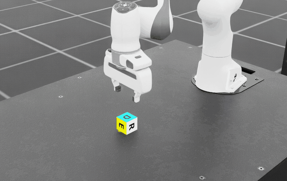

# IPFD: Isaac Policy Failure Debugger

[](https://github.com/yusufdxb/ipfd/actions/workflows/ci.yml)
[](LICENSE)
[](pyproject.toml)
[](https://github.com/yusufdxb/ipfd/releases/latest)

## Research status: archived honest negative

**IPFD is archived. It is not under active research development, and it did not
demonstrate a flagship research capability.** The full report is
[`ARCHIVED_NEGATIVE_RESULT.md`](ARCHIVED_NEGATIVE_RESULT.md).

**Original hypothesis.** A recovery probe restores a recorded simulator state into
a second environment and re-runs it, so its verdict can stand in for what the
uninterrupted episode would have done. Everything IPFD reports downstream, most of
all the Point of No Return index, rests on that substitution.

**What falsified it.** In the tested Isaac Lab lift task, restored branches whose
exposed state, immediate policy observation, and replayed action sequence all
matched the uninterrupted reference still reached a *different* task decision. In
the preserved three-seed cohort, all 120 restored branches matched the recorded
observation immediately after restoration, and 13 of those 120 still reversed the
terminal decision, 10 of them under identical recorded actions.

**The corrected experiment.** A preregistered five-seed study
([`CORRECTED_EXPERIMENT_PROTOCOL.md`](CORRECTED_EXPERIMENT_PROTOCOL.md)) fixed the
confounds in the first cohort: duplicated branch points, mislabeled horizons, and
unmatched disturbance schedules. It compared two declared restoration treatments
([`SNAPSHOT_PROTOCOLS.md`](SNAPSHOT_PROTOCOLS.md)) as a positive control, Protocol A
(`scene_plus_basic_manager_state`) against Protocol B (`expanded_runtime_state`,
which additionally restores action-term buffers, articulation targets, manager and
termination buffers, and disturbance-scheduler state). The registered rule was that
Protocol B had to cut primary decision disagreement by at least 50 percent.

**Key numerical result.** On the primary comparison (exact-action continuation,
`sustained_lift` predicate, 444 paired records) disagreement fell from **18/444
(4.05%) under Protocol A to 11/444 (2.48%) under Protocol B**, a **38.9 percent
relative reduction, below the preregistered 50 percent threshold**. Four of five
seed groups improved; the seed-cluster bootstrap 95% interval on the paired
difference was [-2.48, -0.67] percentage points. Residual disagreement concentrated
at long horizons (Protocol B: 0 of 296 primary records at horizons 1 through 10,
10 of 74 at 90 steps) and in the gripper-open disturbance family (11 of 234); the
object-teleport family reached 0 of 210.

**Why research development stopped.** The stopping rule fired
(`STOP_BRANCH_VALIDITY_DIRECTION`). Because the positive control missed its
threshold, the held-out validity gate was **not eligible to run**, and no
downstream robotics decision, PoNR, controller ranking, or checkpoint selection,
was corrected. Both stages are recorded as `NOT_RUN_STOPPING_RULE` in
[`validity_gate_results.json`](results/branch_validity/corrected_five_seed/validity_gate_results.json)
and
[`downstream_decision_results.json`](results/branch_validity/corrected_five_seed/downstream_decision_results.json).
There is no result here worth building further research on.

**What remains technically useful.** A paired, hash-provenanced measurement
harness for restored-branch decision fidelity in Isaac Lab; two explicitly
documented snapshot protocols and the list of state each one does and does not
restore; a small reproducible observation that exposed-state equality plus
identical replayed actions does not imply decision equality in a contact-rich task
([`ISAACLAB_ENGINEERING_NOTE.md`](ISAACLAB_ENGINEERING_NOTE.md)); and a fail-closed
analysis layer that refuses to certify a validity envelope it cannot support.

**Reproduction entry points.**

```bash
# CPU: re-derive the corrected-study strata, figure, and not-run gate records
python3 scripts/analyze_snapshot_protocol_study.py \
  --study-dir results/branch_validity/corrected_five_seed

# GPU: regenerate the five-seed study itself (see CORRECTED_EXPERIMENT_PROTOCOL.md)
OMNI_KIT_ACCEPT_EULA=YES PYTHONPATH=src "$IPFD_ISAACLAB_ROOT/isaaclab.sh" -p \
  scripts/run_snapshot_protocol_study.py --checkpoint "$IPFD_CHECKPOINT" \
  --asset-root "$IPFD_ASSET_ROOT" --output-dir /tmp/ipfd-corrected-five-seed \
  --isaac-lab-root "$IPFD_ISAACLAB_ROOT"
```

**Limitations.** One task, one robot, one checkpoint, one simulator, one machine,
five independent seed groups. Branch points, horizons, predicates, and
continuations within a seed group are correlated, so five is the real sample size.
Protocol B does not restore unexposed PhysX solver, contact-cache, or broadphase
state, so it is a positive control for *omitted exposed* state only. Entry-USD
hashes do not cover transitive asset dependencies. Nothing here generalizes to
other tasks, simulators, policies, or robots, and nothing here was validated on
hardware.

The final claim this project supports, and nothing wider:

> In the tested Isaac Lab contact-rich manipulation setting, equality of exposed
> restored state, immediate observations, and recorded future actions did not
> guarantee equality of downstream task decisions. Restoring additional
> articulation and manager state reduced, but did not eliminate, decision
> disagreement.

---

# IPFD: Isaac Policy Failure Debugger

A success rate tells you an episode failed. IPFD reports the step after which a
tested recovery controller stopped succeeding from restored simulator branches,
and whether any internal policy signal changed before the failure was externally
visible. The archived result above bounds how far that index can be trusted: the
restored branches it is computed from can reverse the decision they are standing
in for.

Scope is one robot (Franka Emika Panda), one task (`Isaac-Lift-Cube-Franka-v0`,
single-object lift in [Isaac Lab](https://isaac-sim.github.io/IsaacLab/)), and one
output (a per-rollout failure debug report). Detectors are deterministic NumPy. It is
not a benchmark suite, an Isaac Sim extension, or an ML-based detector.

## Evidence status

Read this before the feature list. The CPU analysis layer is stable and tested.
The simulator-side recovery evidence was never revalidated to the release bar, and
the branch-validity study above is why that work stopped rather than continued.

| Area | Status | Backed by |
|---|---|---|
| Analysis layer (detectors, PoNR, metrics, report, plotting) | Stable. Pure NumPy, no simulator import. | 132 tests, 85.59% branch coverage, `ruff` and `mypy` clean, on Python 3.10, 3.11, 3.12 |
| Frozen-fixture reports are byte-stable when regenerated from a recorded rollout | Stable, GPU-free. | `tests/test_replay_fixture.py`. `test_report_reproducible` checks that two in-process builds of one synthetic rollout agree, which is narrower than byte-stability across the Python matrix. |
| IPFD attaches to a live Isaac Lab rollout (env, reset/step, obs structure, report) | Verified on one runtime. | [`scripts/verify_isaac_runtime.py`](scripts/verify_isaac_runtime.py) prints `IPFD_RUNTIME_SMOKE: overall PASS` |
| Probe writes do not move env 0 at the reset boundary | Measured, narrowly. | Historical runs measured max env-0 pose delta of 0.00e+00 m across probe `reset_to` calls. This is a reset-boundary measurement. It does not claim env 0 is static while the vectorized simulator steps every cell. |
| PoNR localizes an expected-PoNR disturbance on a trained policy | Historical fixture only. Classified `historical_fixture_only`; the release evidence gate is not satisfied. | The published fixture used a height-only recovery predicate that an airborne, out-of-reach object can satisfy, which is the teleport disturbance being injected. A conservative physical predicate now exists in the live path. Regenerated simulator evidence is required. See [docs/REVALIDATION.md](docs/REVALIDATION.md). |
| An expected no-PoNR control yields no PoNR | Historical fixture only. | The old slip fixture contains a non-monotone probe verdict sequence, so repeated probes are required before a verdict flip counts as evidence. |
| Imminence alarm localizes the fault | No. | On the trained policy tested, the alarm fires at the grasp transition, before the injected fault. Self-calibrated detectors are noisy across task phases. On a trained policy the usable signal is PoNR, not the alarm. |
| Entropy-collapse detector | No signal on this checkpoint. | The published checkpoint uses a state-independent action std, so the entropy proxy is constant and the detector does not fire. The report shows it flat. |
| The published NVIDIA Lift-Cube checkpoint is competent on the current local runtime | No. Measured 0.00% success. | `scripts/eval_checkpoint.py` over 64 environments reports `max_lift mean=0.000` and `SUCCESS_RATE 0.00%`, and recorded frames show the arm parked away from the cube. This blocks the learned-policy evidence bundle. See [docs/RELEASE_BLOCKERS.md](docs/RELEASE_BLOCKERS.md). |
| The scripted-oracle recovery experiment still reproduces on the current runtime | Yes, as historical diagnostic data. | `scripts/verify_pnor_grasped.py` reproduced its recorded numbers exactly: PoNR 138 against an injected slip at step 127, 68 recoverable and 92 unrecoverable probe verdicts, peak lift 0.179 m. The script labels its own output `HISTORICAL_ONLY`, since it predates the repeated physical predicate and the evidence schema. |
| A restored branch reaches the same task decision as the uninterrupted episode | **Falsified for the tested protocols.** This is the load-bearing assumption under every recovery verdict. | Three-seed cohort: 13/120 paired decision disagreements, 10/60 under identical recorded actions, with 120/120 immediate observation equality. Corrected five-seed study: 11/444 primary disagreements even under the expanded restoration protocol. See [`ARCHIVED_NEGATIVE_RESULT.md`](ARCHIVED_NEGATIVE_RESULT.md). |
| Additional exposed-state restoration fixes it | No. Reduced disagreement, missed the preregistered bar. | 18/444 to 11/444, a 38.9% relative reduction against a registered 50% requirement. `results/branch_validity/corrected_five_seed/protocol_comparison.json`. |

Everything simulator-side above rests on one machine and one checkpoint. Treat it
as a compatibility fingerprint, not a general result. Because restored-branch
decision fidelity is negative for the tested protocols, treat every PoNR number in
this repository as a controller-relative diagnostic over restored branches, not as
a measurement of what the uninterrupted episode would have done.

> **Validated runtime fingerprint:** locally installed `isaaclab` **4.5.22** with
> Isaac Sim **6.0.0.0**. The CPU analysis layer needs neither.

## What the report contains

Given one rollout, IPFD emits a Point of No Return index, the observable-failure
time, the detector alarm time, the timing metrics below, and a stacked timeline plot.

`build_report` computes that index from whatever `recovery_success` labels it is
given. It does not verify who produced them: controller identity, budget, predicate,
stride, and repeat count are optional metadata on `Rollout`. Provenance is enforced
only by the release evidence gate, described below.

The recording below is the failure IPFD is built to time. It is a live capture
from `scripts/verify_pnor_grasped.py` on Isaac Lab 4.5.22, driven by the vendored
scripted pick-lift oracle. The gripper is forced open once the cube is genuinely
grasped and lifted (step 127), the cube falls, and the arm keeps executing its
lift command afterward. In that run the recovery probe placed PoNR at step 138.



Frames come from a Camera sensor in the scene. The headless viewport render
product returns all-zero frames on this runtime, so nothing is captured through
the viewport. This is the scripted oracle, not a learned policy, and the script
labels its own output `HISTORICAL_ONLY`.


This figure is a historical trained-policy artifact, retained as a deterministic
analysis regression. Its alarm (orange) fires before the injected fault, and its
recovery labels come from the height-only predicate now under revalidation. The
title line ("SILENT FAILURE | seed=0") is an analysis verdict over the recorded
arrays, not current proof of physical irrecoverability.

## Point of No Return

A physical optimal-control PoNR cannot be read off a passive log, and one
controller's failure is not proof that a state was doomed. IPFD therefore measures
a narrower, operational quantity against the recovery controller actually run:

```
recovery_success[t] == True  <=>  the supplied recovery controller, restarted from
                                  the saved sim state at step t, satisfies the
                                  supplied success predicate within a fixed budget.

PoNR = the first step after which recovery never again succeeds.
```

Three properties follow, and they bound what the number means:

1. It is **oracle-relative**. A stronger recovery controller can push the measured
   step later, so when positive recovery verdicts are physically sound, the measured
   step is a **lower bound** on the optimal-control PoNR step.
2. A failed recovery attempt is **not** proof of physical irrecoverability.
3. Strided probing resolves PoNR to an interval, not an exact step.

Producing `recovery_success` requires a simulator that can save and restore state.
Consuming it does not. That split is why the analysis layer runs in CI with no GPU.

## Architecture


The recovery probe cannot run in the primary environment. In the validated runtime,
exposed scene state round-tripped exactly while the continued trajectory diverged
after evolved, contact-rich state. The experiment did not isolate which unexposed
simulator or task state caused that divergence. A separate two-environment
measurement showed `reset_to(..., env_ids=[1])` did not change env 0's object pose
at the reset boundary. IPFD therefore uses environment isolation in a decoupled
two-pass design:

- **env 0 (primary)** is rolled out and recorded, and is never `reset_to`.
- **env 1 (probe)** receives origin-shifted snapshots of the primary and runs the
  recovery oracle for a fixed budget. Its verdicts become `recovery_success[t]`.

The analysis layer (`detectors.py`, `ponr.py`, `metrics.py`, `report.py`, `viz.py`,
`types.py`) is pure NumPy and Matplotlib and never imports a simulator.
Simulator-facing code is confined to `adapters/isaac_lab.py` and `oracles/`, both
lazily imported.

To run IPFD on your own task, implement the recovery oracle. See
[**Bring your own recovery oracle**](docs/ORACLE_CONTRACT.md) for the callable
signatures, the exact meaning of `recovery_success[t]`, fixed-budget semantics, and
a copy-adaptable example.

## Quickstart: analysis layer (no GPU, no Isaac Lab)

```bash
pip install -e ".[dev]"
pytest
python3 examples/run_synthetic.py   # writes plots and JSON to examples/figures/
ipfd-demo                           # packaged offline demonstration
```

Given a recorded rollout archive, the same analysis runs as a single command with
no simulator present:

```bash
ipfd analyze rollout.npz --report report.json --plot timeline.png
ipfd analyze rollout.npz --disturbance-onset 56 --probe-stride 8
```

The disturbance arguments produce the conservative causal-actionability
classification described in [docs/CAUSAL_ACTIONABILITY.md](docs/CAUSAL_ACTIONABILITY.md),
which asks whether an alarm followed a known disturbance and preceded the
evidence-bounded PoNR, rather than crediting any early alarm.

```python
from ipfd import build_report, plot_timeline
from ipfd.adapters.synthetic import make_silent_failure_rollout

rollout = make_silent_failure_rollout(seed=0)
report  = build_report(rollout)
print(report.summary())
plot_timeline(rollout, report, "timeline.png")
```

If your shell has sourced ROS, run `env -u PYTHONPATH pytest` so ROS does not
inject its `launch_testing` plugin into this project's test collection.

## GPU validation driver (with Isaac Lab)

Prerequisites: a compatible Isaac Lab runtime, a CUDA GPU, and an Isaac Lab Python
environment. The only locally validated fingerprint is the one above. The first
learned-policy run downloads NVIDIA's published Lift-Cube checkpoint, so it can
take several minutes.

Run the compatibility preflight first:

```bash
OMNI_KIT_ACCEPT_EULA=YES python3 scripts/verify_isaac_runtime.py --headless
```

If your installation resolves assets from a different channel, point both commands
at the tested Isaac 4.5 production tree:

```bash
ASSET_ROOT=https://omniverse-content-production.s3-us-west-2.amazonaws.com/Assets/Isaac/4.5
OMNI_KIT_ACCEPT_EULA=YES python3 scripts/verify_isaac_runtime.py --headless --asset_root "$ASSET_ROOT"
```

The learned-policy driver rolls the checkpoint through the packaged
`collect_rollout`, injects a disturbance, runs the env-isolated recovery probe, and
writes the timeline figure and a machine-readable evidence record. The teleport case
is the expected-PoNR run:

```bash
OMNI_KIT_ACCEPT_EULA=YES \
  python3 scripts/verify_learned_policy.py --headless --use_pretrained \
         --probe --failure teleport --save_plot artifacts/timeline.png \
         --save_rollout artifacts/rollout.npz \
         --json artifacts/recovery-run.json \
         --asset_root "$ASSET_ROOT"
```

Swap `--failure slip` for the expected no-PoNR control. If the policy never
reaches the lift precondition, the command exits non-zero with
`fault_injection_triggered: NO`, which is a runtime or checkpoint compatibility
problem, not a result.

A single run is not evidence. The historical fixture reported PoNR at step 56, but
that value used the retracted height-only predicate and is not a current expected
result. A learned-policy headline would be promoted only if the release evidence gate
accepted a complete bundle: a competence artifact, both failure modes across at
least five seeds, and real actionability cases. The thresholds and the exact
commands are in [docs/EVIDENCE_GATE.md](docs/EVIDENCE_GATE.md). That bundle was
never produced, the gate never passed, and with the project archived it is not
scheduled to be.

The legacy `scripts/verify_pnor_*.py` chain records historical diagnostic
experiments and cannot satisfy the current gate. See
[`scripts/README.md`](scripts/README.md) for the index.

## Metrics

| Metric | Question it answers |
|---|---|
| `time_to_failure` | When did failure become externally observable? |
| `failure_lead_time` | How early did the alarm fire relative to visible failure? |
| `ponr_lead_time` | Did the alarm precede the point of no return? (positive means alarm first) |
| `false_continuity_rate` | What fraction of the doomed window did the detector stay quiet? |
| `drift_magnitude_at_collapse` | How much had the representation drifted at PoNR? |

## Reproducibility

Fixed seeds make the synthetic rollouts deterministic, and reports regenerated from
the frozen recorded fixtures are byte-identical (`tests/test_replay_fixture.py`).
CI runs lint, type checks, branch coverage, source
builds, and installed-package smoke tests on Python 3.10, 3.11, and 3.12 with no
GPU. Live runs write auditable competence and recovery artifacts. The boundary
between what the published package reproduces and what only a live simulator can
establish is stated in
[`docs/GPU_REPRODUCIBILITY.md`](docs/GPU_REPRODUCIBILITY.md).

## Compatibility reports

The simulator results come from one setup. The repository is archived and no
longer solicits work, but the [validation checklist](docs/VALIDATION.md) still
runs and still emits a deterministic, copy-pasteable evidence block if you want to
check the CPU path or the GPU driver against your own runtime.

[ROADMAP.md](ROADMAP.md) records the direction that was planned and why it was
dropped. It is a historical document, not a plan.

## License

MIT, see [`LICENSE`](LICENSE). `src/ipfd/oracles/pick_lift_sm.py` is vendored from
Isaac Lab under BSD-3-Clause, see
[`THIRD_PARTY_LICENSES.md`](THIRD_PARTY_LICENSES.md).
