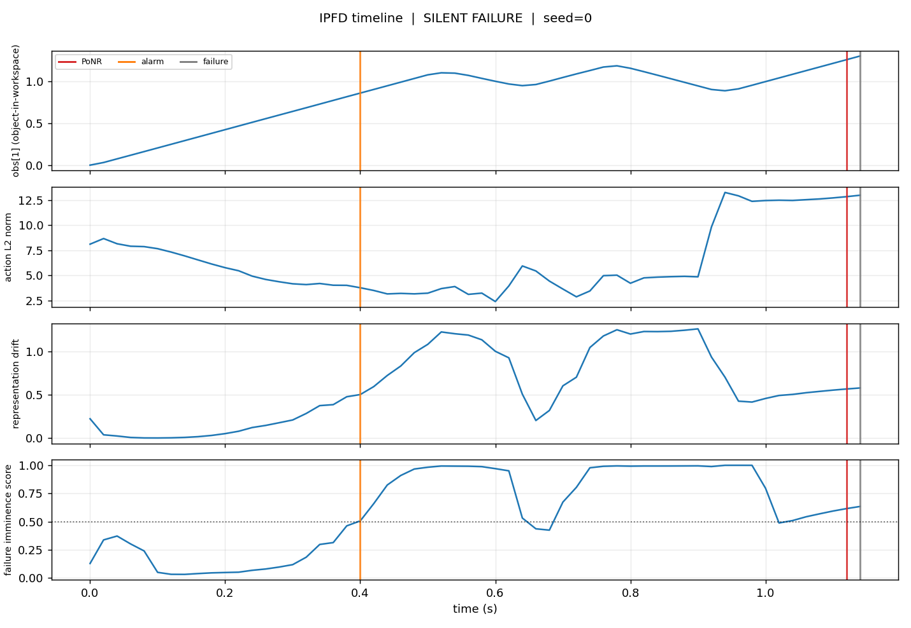
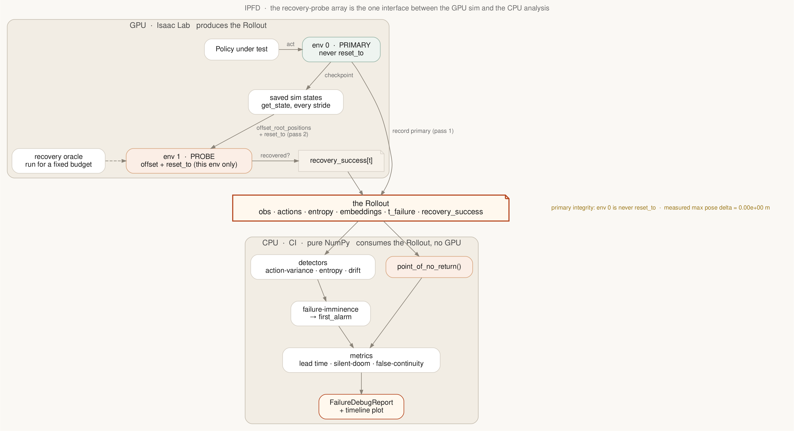
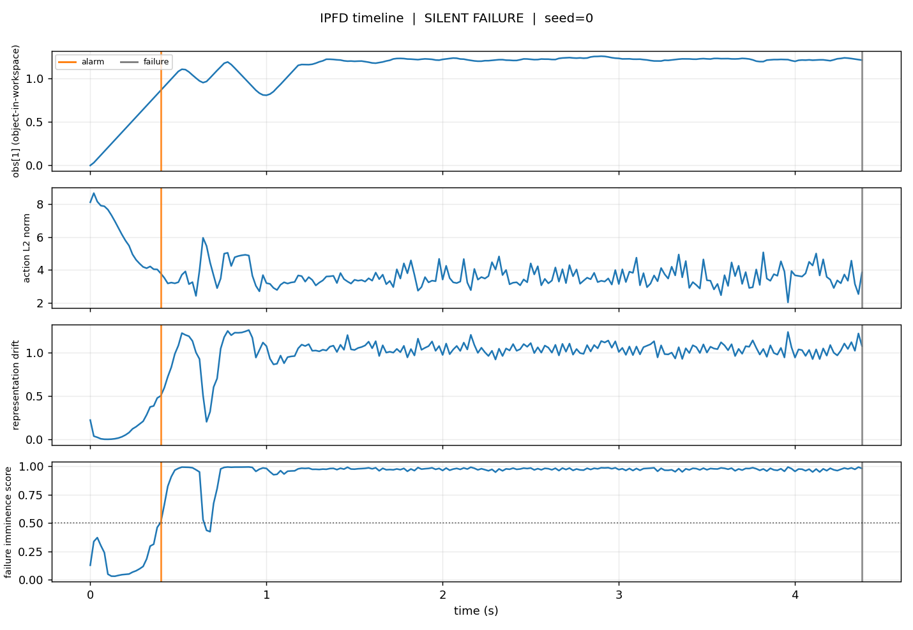

# IPFD — Isaac Policy Failure Debugger

**Find the exact moment a manipulation policy became unrecoverable — and whether any internal signal knew before the failure was visible.**

IPFD is a small, headless debugging utility for robot-policy rollouts in
[Isaac Lab](https://isaac-sim.github.io/IsaacLab/). Scope is deliberately narrow:
**Franka Emika Panda, single-object pick-and-place.** One sharp tool that does one
thing well — no benchmark suite, no Kit extension, no ML in the detectors.

---

## The problem

You train a manipulation policy. It reports, say, 85% success. The other 15% of
episodes end with the cube on the floor. An average-success number tells you *that*
those episodes failed. It cannot tell you the two things you actually need in order
to debug them:

1. **When did the episode become irrecoverable** — the point after which no
   controller, however good, could still reach the goal?
2. **Did any internal signal know** — action statistics, policy confidence, latent
   drift — *before* the failure was externally observable?

The dangerous case is a policy that stays smooth and confident well *after* it has
entered a doomed trajectory. Success-rate evaluation counts that episode as "fine"
right up until the object hits the floor. That silent interval — doomed but still
looking healthy — is what IPFD makes visible.

## What IPFD produces

Given one rollout, IPFD emits a **failure debug report**: the Point of No Return,
the observable-failure time, the detector alarm time, a small set of timing
metrics, and a stacked timeline plot. Here is the real output on a trained policy
(the teleport scenario below); the alarm (orange) fires at the grasp transition,
the Point of No Return (red) lands at the injected doom, just before observable
failure (grey):



---

## The one hard idea: Point of No Return

"The first timestep the task is irrecoverable, even under optimal control" **cannot
be read off a passive log** — you only know a state was doomed by *trying to recover
from it and failing*. So IPFD defines PoNR operationally against a **recovery probe**:

```
recovery_success[t] == True  <=>  a best-effort recovery controller, restarted from
                                  the saved sim state at step t, reaches the goal
                                  within a fixed budget.

PoNR = the first step after which recovery never again succeeds.
```

This is a **sound upper bound** on the true optimal-control PoNR: a better recovery
controller can only push it later. We say *"irrecoverable under the provided recovery
oracle,"* not *"provably irrecoverable."* Producing `recovery_success` needs a
simulator that can save/restore state; consuming it does not. **That boundary is the
whole architecture.**

## Architecture: the dual-environment recovery probe



The recovery probe cannot run in the primary environment. On Isaac Lab 4.5.22, a
single `reset_to` corrupts a `num_envs == 1` sim after a grasp (the PhysX
contact/solver cache is not part of `scene.get_state()`), and the corruption
survives `env.reset()`. But `reset_to` is **local to the reset env**. So the probe
uses **environment isolation**, in a **decoupled two-pass**:

- **env 0 (PRIMARY)** is rolled out and recorded, and is **never** `reset_to`.
- **env 1 (PROBE)** receives origin-shifted snapshots of the primary and runs the
  recovery oracle for a fixed budget; its verdicts become `recovery_success[t]`.

The analysis layer — detectors, PoNR, metrics, report, plotting — is **pure
NumPy/Matplotlib** and never imports a simulator. It runs in CI with no GPU. Only
`ipfd.adapters.isaac_lab` and `ipfd.oracles.*` touch Isaac Lab, and they are lazily
imported.

```
src/ipfd/
  types.py              Rollout — the single unit of analysis (pure NumPy arrays)
  detectors.py          action-variance / entropy-collapse / drift -> imminence score
  ponr.py               Point of No Return from a recovery-probe array
  metrics.py            time-to-failure, lead time, silent-doom, false continuity
  report.py             build_report() -> FailureDebugReport (+ .summary(), .to_json())
  viz.py                plot_timeline() — the stacked-panel figure above (Agg, headless)
  adapters/isaac_lab.py collect_rollout + env-isolated recovery probe (GPU, gated)
  oracles/              recovery controllers: pick_lift_sm (scripted), rsl_rl_policy (trained)
```

---

## Verified results

Every claim below maps to a script in this repository. Runs are on Isaac Lab 4.5.22
with a CUDA GPU. The analysis-layer claims run in CI with no GPU.

### Verified

| Claim | Evidence |
|---|---|
| The analysis layer is pure NumPy, tested, and byte-reproducible. | 31 tests pass, `ruff` clean; `test_report_reproducible`. CI runs lint + tests + a headless example on Python 3.10/3.11. |
| IPFD attaches to a **real** Isaac Lab rollout (import, env, reset/step, obs structure, `build_report`). | [`scripts/verify_isaac_runtime.py`](scripts/verify_isaac_runtime.py) → `IPFD_RUNTIME_SMOKE: overall PASS`. |
| The env-isolated probe **never perturbs the primary**. | Measured `max env-0 pose delta = 0.00e+00 m` across probe resets — on the scripted policy ([`verify_pnor_grasped.py`](scripts/verify_pnor_grasped.py), 51 resets) and the trained policy ([`verify_learned_policy.py`](scripts/verify_learned_policy.py), 8–28 resets). |
| On a **genuinely competent trained policy**, PoNR localizes an irrecoverable failure. | Official NVIDIA-published `rsl_rl` Lift-Cube checkpoint (100% lift, mean 0.585 m, measured by [`eval_checkpoint.py`](scripts/eval_checkpoint.py)). Teleporting the cube out of reach → recovery verdicts flip → **PoNR at the injected doom, +0.72 s before the alarm's actionable window**. |
| A **recoverable** failure correctly yields **no PoNR**. | A gripper slip drops the cube within reach; the competent policy re-grasps it in the probe, so recovery stays true and IPFD reports no Point of No Return.  |
| The **packaged library API is the exact code that produced these results.** | [`verify_learned_policy.py`](scripts/verify_learned_policy.py) drives `ipfd.adapters.isaac_lab.collect_rollout` end-to-end; results reproduce bit-for-bit. |

### Partially verified

| Claim | Honest bound |
|---|---|
| Silent-collapse **detection** on a trained policy. | The imminence alarm *fires*, but on this policy it fires at the natural **grasp transition** — before the injected fault. Self-calibrated detectors are noisy across a real policy's task phases. On a trained policy the reliable signal is **PoNR**, not the alarm. |
| **Entropy-collapse** detector. | The official checkpoint uses a *state-independent* action std, so the entropy signal is **flat** and that detector does not fire. IPFD reports it flat rather than hiding it. |
| Scripted-policy PoNR. | Holds in the **grasped region**, where the recovery oracle can adjudicate. **Pre-grasp** checkpoints stay noisy: `reset_to` hands the probe a cold PhysX contact state that derails a scripted sub-cm re-grasp — a controller property, not an IPFD gap. |

### Future work

- **Phase-aware detector calibration**, so the imminence alarm localizes the fault
  rather than task transitions.
- A **rendered rollout GIF** from an actual run (needs a rendered viewport;
  headless offscreen capture in the current setup produced empty frames — not shipped
  rather than faked).
- Tasks beyond Franka single-object pick-and-place.

---

## Quickstart — analysis layer (no GPU, no Isaac Lab)

```bash
pip install -e ".[dev]"            # analysis layer only
pytest                             # 31 tests, all pure-NumPy
python examples/run_synthetic.py   # prints two reports, writes plots + JSON to examples/figures/
```

```python
from ipfd import build_report, plot_timeline
from ipfd.adapters.synthetic import make_silent_failure_rollout

rollout = make_silent_failure_rollout(seed=0)
report  = build_report(rollout)
print(report.summary())
plot_timeline(rollout, report, "timeline.png")
```

## 60-second demo — on a real trained policy (with Isaac Lab)

One command. It fetches NVIDIA's official published Lift-Cube checkpoint, rolls it
out through the packaged `collect_rollout`, injects an irrecoverable failure, runs
the env-isolated recovery probe, and writes the timeline figure:

```bash
OMNI_KIT_ACCEPT_EULA=YES \
  python scripts/verify_learned_policy.py --headless --use_pretrained \
         --probe --failure teleport --save_plot timeline.png
```

Expected (measured): `ponr_detected: YES`, PoNR at step 56 (1.12 s), observable
failure at step 57, `primary_integrity_max_delta_m: 0.0`. Swap `--failure slip` for
the recoverable case, which correctly reports **no** PoNR. To sanity-check runtime
compatibility only:

```bash
OMNI_KIT_ACCEPT_EULA=YES python scripts/verify_isaac_runtime.py --headless
```

The `scripts/verify_pnor_*.py` chain is the underlying evidence trail; see
[`scripts/README.md`](scripts/README.md) for the index.

---

## Metrics (the minimal set)

| Metric | Question it answers |
|---|---|
| `time_to_failure` | When did failure become externally observable? |
| `failure_lead_time` | How early did the alarm fire vs visible failure? |
| `ponr_lead_time` | Did the alarm precede the point of no return? (+ve = actionable) |
| `false_continuity_rate` | What fraction of the doomed window did the detector stay quiet? |
| `drift_magnitude_at_collapse` | How much had the representation drifted at PoNR? |

## Reproducibility

Fixed seeds throughout; synthetic rollouts and reports are byte-reproducible
(`test_report_reproducible`). CI runs lint + tests + a headless example smoke-run on
Python 3.10 and 3.11 with no GPU. The GPU experiments print machine-readable status
blocks (`IPFD_RUNTIME_SMOKE`, `IPFD_LEARNED_STATUS`, `DUAL_PROBE_STATUS`).

## License

MIT. `src/ipfd/oracles/pick_lift_sm.py` is vendored from Isaac Lab under BSD-3-Clause;
see [`LICENSE`](LICENSE).
